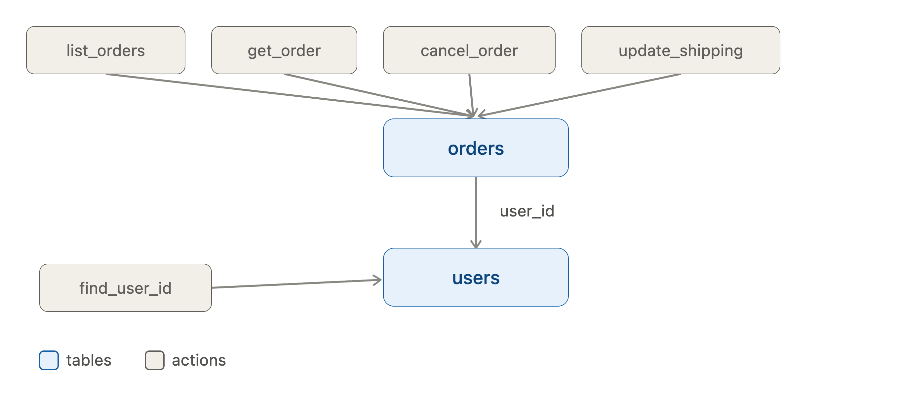
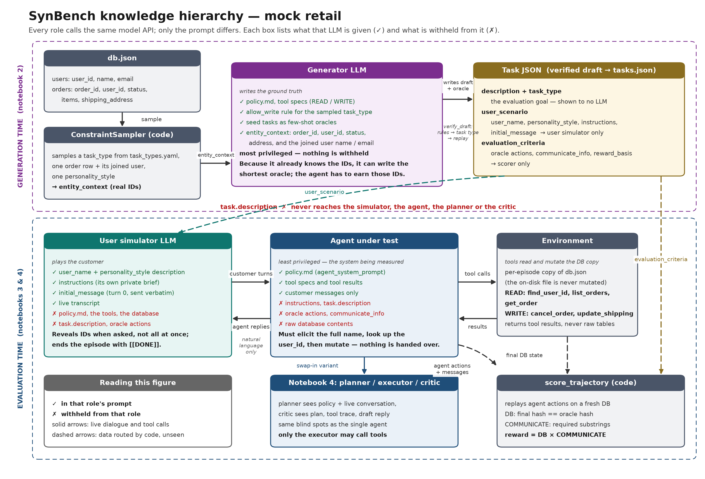

# Mock Retail domain

Mock Retail is a tiny customer-service world used as the worked example for SynBench. The agent under test is a **customer service agent**. It talks to a simulated customer, calls tools against a **copy** of `db.json`, and is scored on **outcomes**: final database state plus required phrases in its replies, not on copying the oracle tool sequence.

Pipeline notebooks (from `implementations/agent_benchmark_generation/`):

- `2-generate_and_verify_tasks.ipynb` — load this domain, generate drafts, verify, write `tasks.json`
- `3-single_agent_evaluation.ipynb` — single tool-calling agent
- `4-multi_agent_pipeline_evaluation.ipynb` — planner / executor / critic

Which models those notebooks call is **not** defined here; it comes from `.env` and the notebook cells.

---

## Mental picture of the world


<div align="center">
  
</div>

- **`users`** is the parent table; **`orders`** is the child, keyed by `order_id`, with foreign key `user_id`.
- Order `status` in this sample DB is `pending` or `shipped`. Canceling a pending order sets status to `canceled`.
- Policy: customers do **not** know their `user_id`. The agent should ask for the customer's **full name**, call `find_user_id`, then use `list_orders` / `get_order` before mutating.

| Tool | Role |
|------|------|
| `find_user_id`, `list_orders`, `get_order` | READ |
| `cancel_order`, `update_shipping` | WRITE |

---

## Who knows what

SynBench uses several LLM roles. They share the same API credentials, but **different prompts and hidden fields**. That knowledge hierarchy is intentional: the generator can write a short oracle because it sees IDs; the agent must elicit details from conversation.

| Role | Prompt / config source | Sees | Hidden |
|------|------------------------|------|--------|
| **Generator LLM** | `PromptBuilder` + `generation.yaml` | Policy, tool specs, task-type rules, seed tasks, sampled `entity_context` (IDs + related user), personality style | — (most privileged; writes the oracle) |
| **User simulator** | `user_simulator.yaml` + `user_scenario` | `user_name`, style catalog text, `instructions`, `initial_message`, live transcript | Policy, tools, DB, `task.description` |
| **Agent under test** | `agent_system_prompt` (`agent_role` + `policy.md`) | Policy, tools, customer messages | `instructions`, `description`, oracle actions, raw DB |
| **Planner / critic** (notebook 4) | Policy excerpts | Policy, live conversation (planner) / plan + tool trace + draft reply (critic) | `instructions`, `description`, oracle actions, raw DB |

<div align="center">
  
</div>

The figure shows the same hierarchy as a flow: the generator sees the sampled IDs and writes the oracle, the simulator only ever sees its slice of the task (`user_scenario`), and the agent under test sees policy plus customer messages and reaches the database only through tools. Solid arrows are live dialogue and tool calls; dashed arrows are data that code moves between roles. Regenerate it with `uv run --with matplotlib python images/knowledge_hierarchy_figure.py`.

Dialogue details:

- Turn 0 is `user_scenario.initial_message` sent **as-is**. The simulator does not rewrite it.
- Later customer turns come from the user-simulator LLM, which should reveal IDs when asked, not dump everything unprompted.
- The simulator ends the conversation with exactly `[[DONE]]`.

---

## Domain folder map

`load_domain` requires every file below except `verify.py`. Notebook 2 also runs `validate_domain()`, which checks that `ToolKit` method names match specs, that `task_types.yaml` is non-empty, and that `generation.yaml` joins line up with `db.json`.

| File | Required? | Loaded into |
|------|-----------|-------------|
| `policy.md` | yes | `bundle.policy` (string) |
| `db.json` | yes | `bundle.db` |
| `tools.py` | yes | specs via `get_tool_specs()`; runtime via `ToolKit` |
| `task_types.yaml` | yes | `bundle.task_types` |
| `user_simulator.yaml` | yes | `bundle.user_simulator` |
| `tasks.seed.json` | yes | `bundle.seed_tasks` (few-shot for the generator) |
| `generation.yaml` | yes | `bundle.generation` |
| `verify.py` | optional | `check_domain_rules` if present |

Generated benchmark tasks live at `data/benchmarks/mock_retail/tasks.json`. That file is **not** part of the domain bundle.

---

## File-by-file

### `db.json`

Initial world state. Top-level keys are table names; each table is `{id: record, ...}`.

- `users`: `user_id`, `name`, `email`
- `orders`: `order_id`, `user_id`, `status`, `items`, `shipping_address`

Each evaluation episode and each oracle replay uses a **copy**. The on-disk file is never mutated.

NOTE: keep at least one **pending** order (cancel) and one **non-pending** order (refuse_cancel), plus enough users that `find_user_id` can succeed for seed / sampled names.

### `policy.md`

Natural-language rules for the agent (lookup-by-name, confirm before mutate, cancel only if `pending`, refuse otherwise, confirm new shipping address, never invent IDs).

SynBench injects this text into the **generator** prompt (truncated) and into **agent / planner / critic** prompts (agent prompt uses up to 4000 characters). `verify.py` encodes a **subset** of these rules as hard checks on **oracle drafts**, not on the live agent.

NOTE: keep policy aligned with tool behavior (e.g. `cancel_order` already rejects non-pending status).

### `tools.py`

Two contracts in one module:

1. **`get_tool_specs()`** — names, descriptions, JSON parameter schemas, `ToolType` (READ/WRITE). Used for generation prompts, OpenAI tool schemas, and the `allow_write` check. `ToolType` is what marks a tool as a write; there is no separate tag.
2. **`ToolKit(db)`** — methods with the **same names**, dispatched by `Environment`. `__init__` takes the mutable DB dict.

Intended lookup order (also in policy): full name → `find_user_id` → `list_orders` / `get_order` → then `cancel_order` or `update_shipping`.

To author: every spec `name` must be a `ToolKit` method. WRITE tools must not appear on `allow_write: false` task types, and write task types need at least one WRITE tool in the oracle.

### `task_types.yaml`

Defines **task types** used for sampling, generation conditioning, and oracle validation. Scoring compares the **final DB**, so validation does **not** require an ordered lookup/mutate path — only whether the oracle may use WRITE tools:

| `task_type` | Meaning | `allow_write` |
|-------------|---------|---------------|
| `inquiry` | Read-only order lookup | false |
| `cancel` | Cancel a pending order after lookup | true |
| `update_address` | Update shipping after lookup | true |
| `refuse_cancel` | Lookup only; agent should refuse cancellation | false |

`allow_write: false` forbids WRITE tools; `allow_write: true` requires at least one WRITE tool. Action count and order are not checked.

### `user_simulator.yaml`

- **`personality_styles`** — catalog of `{name, description}`. The sampler draws a `name` (`rushed`, `anxious`, `rule_breaker`, `inconsistent`, `domain_expert`). The user-sim prompt looks up the description. Task JSON stores the **key**, not free-form personality prose.
- **`persona`** — fallback display name if a task omits `user_scenario.user_name`.
- **`goal_templates`** — present in this file for documentation / future use; **not consumed** by library code today.

### `generation.yaml`

SynBench is domain-agnostic; this file tells the library how **this** world is shaped. It is loaded into `DomainBundle.generation` and used by:

1. **ConstraintSampler** — which DB rows / IDs to sample for each draft
2. **PromptBuilder** — wording + entity snapshot in the generation prompt
3. **`agent_system_prompt`** — `agent_role` at evaluation time (`"customer service agent"`)

Retail mapping:

- `primary_collection: orders` — sampler picks a random order
- `id_field: order_id` — primary id in constraints, user instructions, and tool args
- `related.user_id` — join `orders.user_id` → `users`; prompt fields `name`, `email`
- `context_fields` — order columns shown in `entity_context` (`order_id`, `user_id`, `status`, `shipping_address`)
- `persona_related` / `persona_field` — optional `user_scenario.user_name` from `users.name`
- `communicate_hints` — per-`task_type` hints for `evaluation_criteria.communicate_info`

Comments in the YAML itself are the field-level reference.

### `tasks.seed.json`

Hand-written few-shot tasks the generator imitates (PromptBuilder prefers seeds matching the sampled `task_type`). This domain has four seeds, one per task type: `seed_inquiry`, `seed_cancel`, `seed_refuse_cancel`, `seed_update_address`.

They must replay cleanly, respect `allow_write` for their `task_type`, and use communicate phrases that match the intended outcome.

### `verify.py`

Optional hook: `check_domain_rules(domain, draft) -> list[str]`. Empty list means pass.

Retail rule: for `task_type == "cancel"`, every `cancel_order` oracle action must target an order whose **initial** status is `pending`.

`verify_draft` order: **domain rules → task-type write rules → oracle replay** (target DB hash).

---

## Task JSON anatomy

Each task has three parts: metadata (`id`, `description`, `task_type`), **`user_scenario`** (user simulator), and **`evaluation_criteria`** (oracle + scoring).

The agent under test (and the notebook 4 planner / critic) do **not** see `task.description` or `user_scenario.instructions`. They must infer intent from the conversation.

- **`id`** — unique task id
- **`description`** — high-level **evaluation goal**. Must match `task_type` and policy. Not shown to the agent, planner, or critic.
- **`task_type`** — one of the keys in `task_types.yaml`. Sampled **before** generation so the LLM is conditioned (fidelity / diversity), not free to invent any scenario.

**`user_scenario`** (passed to the user simulator):

- **`user_name`** — first and last name (often from the related user row)
- **`personality_style`** — catalog key from `user_simulator.yaml`
- **`instructions`** — clean brief for the **simulator** (and grounding for the oracle). Include `order_id` (this domain's `id_field`) and any other args the oracle needs (new address, etc.). No personality theatrics. Must be consistent with `description` / `task_type` / oracle actions. **Not shown to the agent.**
- **`initial_message`** — first customer utterance, written **in the sampled style**. Prefer **partial disclosure** so the agent must ask follow-ups.

**`evaluation_criteria`:**

- **`actions`** — ground-truth (oracle) tool calls. Replayed on the original DB to produce the **target DB hash**. Usually the shortest path, because the generator already knows IDs/args that the agent must elicit.
- **`communicate_info`** — substrings that must appear in **agent** replies (case-insensitive). `[]` is valid for inquiry. Hints per type live in `generation.yaml`.
- **`reward_basis`** — for this domain always `["DB", "COMMUNICATE"]`. Final reward is the **product** of those components. Other bases could be defined in the library later.

Scoring compares outcomes, not exact tool traces. `partial_action_match` (overlap of action fingerprints) is diagnostic only.

Example (`seed_cancel`):

```json
{
  "id": "seed_cancel",
  "description": "Cancel a pending order",
  "task_type": "cancel",
  "user_scenario": {
    "user_name": "Alice Chen",
    "personality_style": "anxious",
    "instructions": "Request cancellation of pending order ord_1001.",
    "initial_message": "I'm worried my order will ship before I can stop it — can you help?"
  },
  "evaluation_criteria": {
    "actions": [
      {"name": "get_order", "arguments": {"order_id": "ord_1001"}},
      {"name": "cancel_order", "arguments": {"order_id": "ord_1001"}}
    ],
    "communicate_info": ["canceled"],
    "reward_basis": ["DB", "COMMUNICATE"]
  }
}
```

---

## Constraint sampling (before generation)

Before each draft, **ConstraintSampler** draws a guided generation context (not a full existing task):

1. Sample a `task_type` uniformly from `task_types.yaml`.
2. Sample a record from `db[primary_collection]` (here: **orders**).
3. Resolve `related` joins (here: user via `user_id`). Related fields plus `context_fields` become **`entity_context`** in the generator prompt.
4. Sample a `personality_style` from `user_simulator.yaml`.

**PromptBuilder** then fills the generation prompt with policy, tool specs, the write rule for that type, `communicate_hints`, `entity_context`, and 1–2 seed tasks.

The generator LLM returns a draft Task. Passing drafts (`verify_draft`) are written to `data/benchmarks/mock_retail/tasks.json`. Dedup is by **ordered oracle action fingerprint**, so distinct read-only tasks are not collapsed just because the DB did not change.

---

## How this domain is used at evaluation time

No extra domain files. For each task:

1. Environment clones `db.json` and binds `ToolKit`.
2. User simulator + agent (or pipeline) run a multi-turn dialogue; only the agent / executor calls tools.
3. `score_trajectory` replays the agent's actions on a **fresh** env, compares DB hash to the oracle hash (`DB`), and checks `communicate_info` in agent messages (`COMMUNICATE`).

Notebook 3 uses `SingleToolAgent`. Notebook 4 uses `AgentPipeline`: per turn `user_sim` → `planner` → `executor` → `critic` (only the executor calls tools).

---

## Editing this domain vs copying it

To **extend mock retail**, edit files in this folder: add DB rows, tools, policy bullets, task types, seeds, `verify.py` rules, or `generation.yaml` fields. Keep specs, `ToolKit` methods, `allow_write`, and policy in agreement.

To add a **different** domain, copy this folder and retarget collections, tools, and seeds. The checklist is in the [parent SynBench README](../../README.md#adding-a-new-domain).
