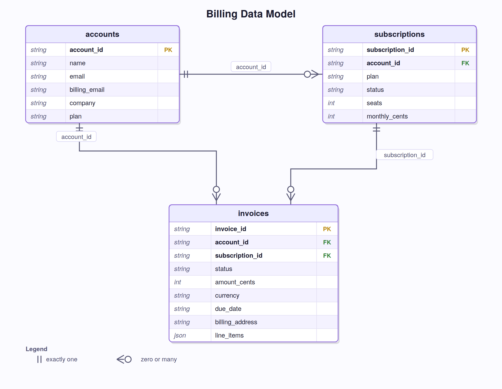

# Mock SaaS Billing

A **billing support** domain used to scale SynBench beyond the tiny retail example. Same generation → verify → score loop; larger world, more tables, and stricter write rules.

| | Mock retail | Mock SaaS billing |
|---|---|---|
| Agent | Customer service | Billing support |
| World |  2 users + 3 orders | 48 accounts, 96 subscriptions, 192 invoices |
| Primary sample | `orders` | `invoices` (with nested `line_items`) |
| Writes | Cancel order, update shipping | Void invoice, update billing email, update seats |
| Notebooks | `2`–`4` | `5-saas-billing-scale.ipynb` |

Mechanics (roles, task JSON, scoring) are the same as [mock retail](../mock_retail/README.md). 


---

## Notebook 5

[`5-saas-billing-scale.ipynb`](../../5-saas-billing-scale.ipynb) is the worked example for this domain. It compresses notebooks 2–4 onto one larger world:

1. Load and validate the domain.
2. Replay a seed oracle so scoring’s target DB hash is visible.
3. Generate **25 drafts**: 5 task types × 5 personalities, distinct accounts per type. Seat-change drafts skip inactive subscriptions.
4. Verify (domain rules → write rules → replay) and write `data/benchmarks/mock_saas_billing/tasks.json`.
5. Reload and re-verify saved tasks.
6. Run the **multi-agent pipeline** (user sim → planner → executor → critic) and inspect a few examples.
7. Run the full generated benchmark on two agentic pipelines backed by different LLMs.

Run notebooks **1–4 on retail first**, then this one. 

---

## Database schema

`accounts` is the parent. Each account has two subscriptions and four invoices. Invoices point at both the account and one of its subscriptions.

<div align="center">
  
</div>

Statuses you will see in `db.json`:

- **Invoice:** `open` | `past_due` | `paid` | `void`
- **Subscription:** `active` | `past_due` | `canceled`

Customers do **not** know `account_id`. Lookup order: full name → `find_account_id` → `list_invoices` / `list_subscriptions` / `get_invoice` → then a write, if policy allows.

| Tool | Role |
|------|------|
| `find_account_id`, `get_invoice`, `list_invoices`, `list_subscriptions` | READ |
| `void_invoice`, `update_billing_email`, `update_seats` | WRITE |

Regenerate a deterministic DB (pinned seed invoices stay put):

```bash
python implementations/agent_benchmark_generation/domains/mock_saas_billing/build_db.py
```

Replace `db.json` with your own database.

---

## Policy in short

Full text: [`policy.md`](policy.md). The agent is scored on **outcomes** (final DB + required phrases), but it is supposed to follow these rules.

**Identity**

- Ask for the customer’s **full name**; call `find_account_id`. Never invent IDs.
- If nothing matches, ask them to confirm the name. Do not continue.
- Never touch another account’s invoices or subscriptions.

**Invoices — when a void is allowed**

Look up the invoice and confirm **amount, status, and due date** before treating an inquiry as done or attempting a void. Do not rewrite date formats.

| Invoice `status` | Inquiry | Customer asks to void | Agent should |
|------------------|---------|------------------------|--------------|
| `open` | OK | Eligible | Void, then confirm |
| `past_due` | OK | Eligible | Void, then confirm |
| `paid` | OK | **Not** eligible | Refuse; explain it is paid |
| `void` | OK | **Not** eligible | Refuse; explain it is already void |

`void_invoice` in tools.py matches this: only `open` or `past_due` succeed.

**Account and subscription changes**

- **Billing email:** confirm the new address with the customer, update it, repeat the email in the final reply.
- **Seats:** list subscriptions first. Change seats only on an **`active`** subscription; new count must be a **positive integer**. Repeat the new count in the final reply.

---

## Task types

Two hand-verified seeds per type live in `tasks.seed.json`. Sampling filters invoices in `generation.yaml` so drafts start from a row that can satisfy policy.

| `task_type` | Meaning | Sampled invoice status | `allow_write` |
|-------------|---------|------------------------|---------------|
| `inquiry` | Read invoice details | any | false |
| `void_invoice` | Void after lookup | `open`, `past_due` | true |
| `refuse_void` | Lookup and refuse | `paid` | false |
| `update_billing_email` | Change account email | live (`open` / `paid` / `past_due`) | true |
| `update_seats` | Change seats on an active sub | live invoice; skip inactive subs in notebook 5 | true |

`verify.py` checks oracles: void only on `open`/`past_due`, seats only on `active` with a positive integer.

Typical communicate phrases: inquiry may be empty; void uses `"voided"`; refuse uses `"cannot be voided"`; email/seats must include the new value.
