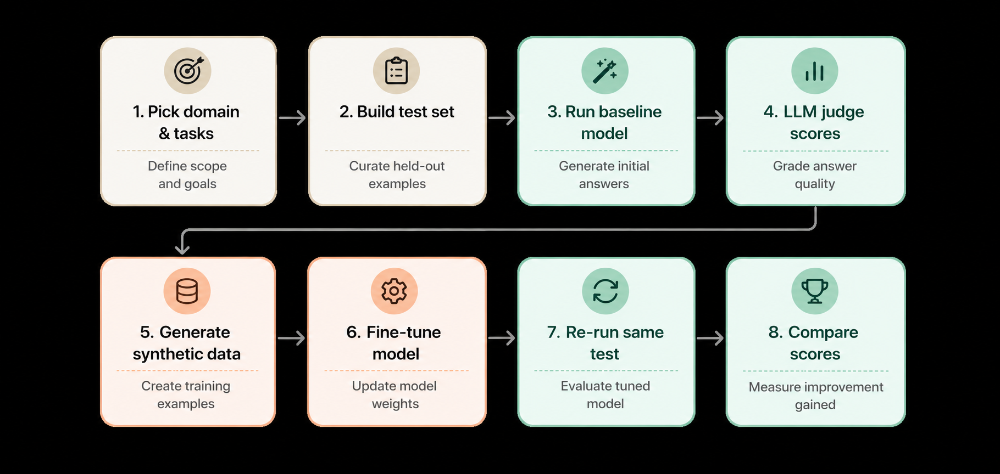
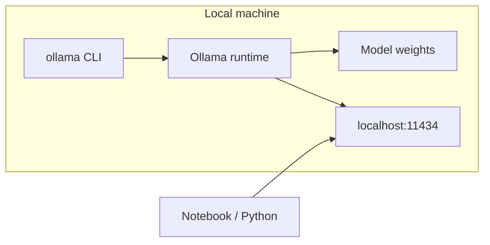
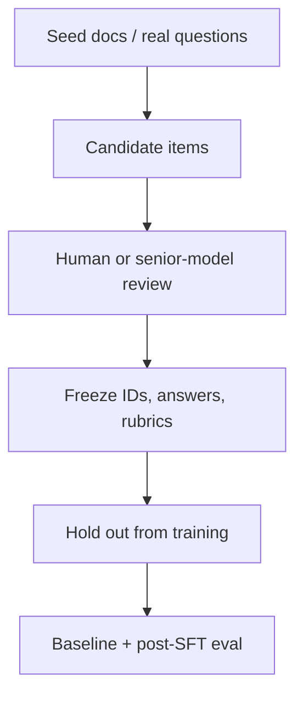
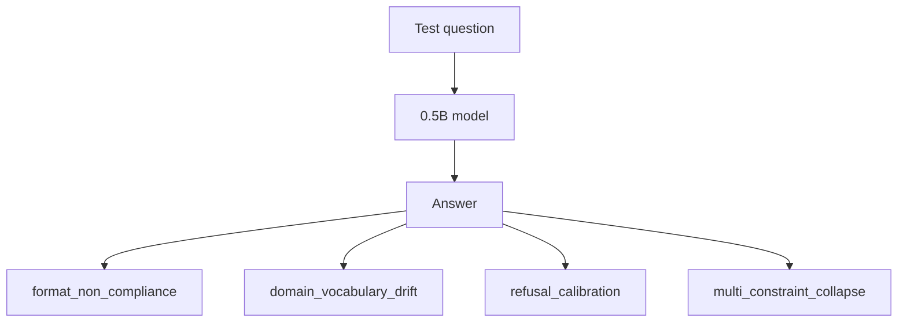
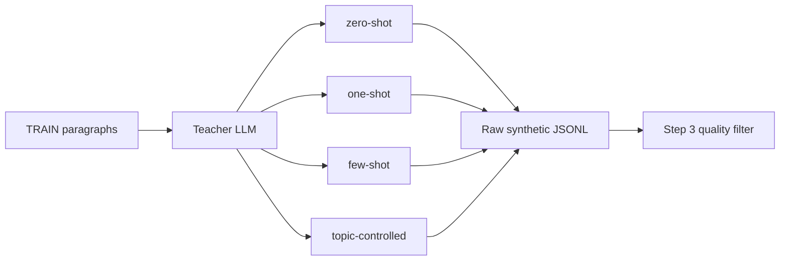
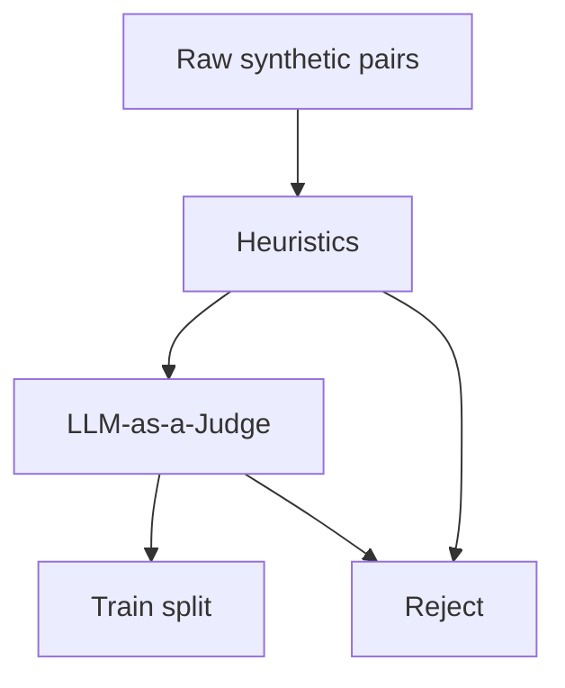
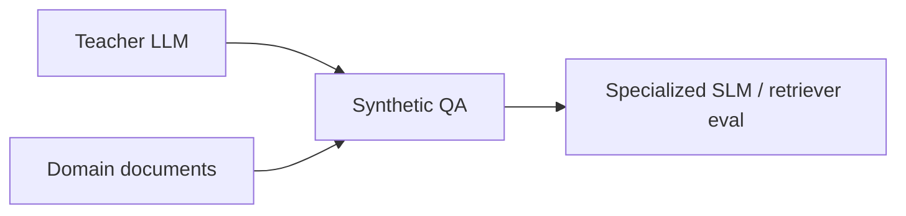
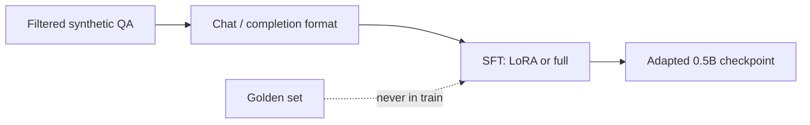
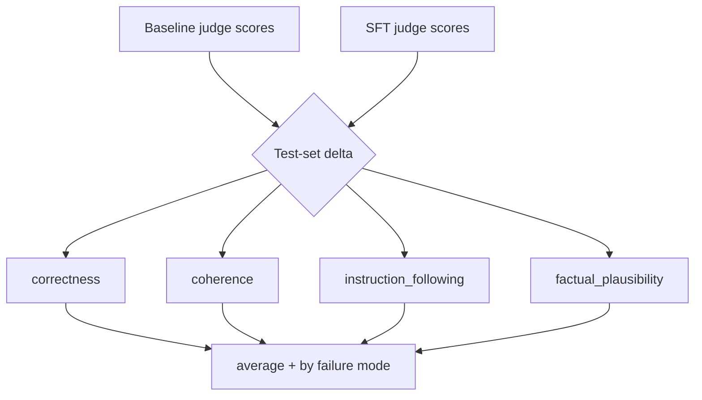

# Learning Objectives

This track is a **data-centric loop**: measure a small model, generate synthetic QA, judge quality, fine-tune, and measure again.



| Day | Focus | Outcome |
| --- | --- | --- |
| Day 1 | Baseline + generation | A measured starting point and a synthetic dataset |
| Day 2 | Evaluation + fine-tuning | Evidence that the synthetic data actually helps |

---

## Learn Day 1 (Baseline, Generation)

- Ollama - Hosting and running models on CPU
- Build a golden test set with different failure moeds
- Build a training set
- Synthetic text/QA generation strategies

---

### Ollama: hosting and running models on CPU

**Ollama** is a local runtime for open-weight models. You pull a model once, then serve it over an OpenAI-compatible API on your laptop.



Why start here:

- No GPU required for tiny models such as Qwen 0.5B
- Same API shape as cloud chat completions, so notebook code stays portable
- Weights stay on disk; prompts never leave the machine
- Cheap iteration: swap models with one `ollama pull`

---

### Why Ollama?

| Need | What Ollama gives you |
| --- | --- |
| Repeatable demos | Pinned local weights, not a moving cloud snapshot |
| Privacy / offline | No traffic to a vendor API |
| Same API as notebooks | OpenAI-compatible `localhost` endpoint; swap models without rewriting eval code |
| Cost | Pull once; generate thousands of pairs without token bills |

Cloud APIs are excellent generators and judges. They are a poor stand-in for the **student model** you are trying to improve.

---

### Why a 0.5B model when APIs and larger models exist?

A 0.5B **small language model (SLM)** is the point of the exercise, not a compromise.


| If you only used a large API… | What you would miss |
| --- | --- |
| Answers already look “good enough” | Failure modes stay hidden |
| You cannot fine-tune the endpoint | You never close the data loop |
| Latency and cost hide in the cloud | You do not feel CPU / memory constraints |
| The demo is prompting | The skill is **dataset design** |

Use the large model as a **teacher**. Use the 0.5B model as the **student** you ship, specialize, or run on-device.

---

### Useful Ollama commands

```bash
# install once, then:
ollama serve                          # start the local server (often already running)
ollama pull qwen2.5:0.5b              # download weights
ollama run qwen2.5:0.5b               # interactive chat in the terminal
ollama list                           # models on disk
ollama ps                             # models currently loaded
ollama show qwen2.5:0.5b              # architecture, params, context
ollama rm qwen2.5:0.5b                # free disk if you are done
```

Python talks to `http://localhost:11434` with the OpenAI client (`base_url=.../v1`). Keep `OLLAMA_HOST` and the model name in `.env` so notebooks stay switchable.

---

### Similar models to Qwen 0.5B you can try

Stay in the **sub-2B, CPU-friendly** band so fine-tuning and baseline eval still fit a laptop.

| Model (Ollama tag, check Hub for exact names) | Size | Notes |
| --- | --- | --- |
| `qwen2.5:0.5b` | 0.5B | Default student; instruction-tuned |
| `qwen2.5:1.5b` | 1.5B | Same family, stronger baseline, slower on CPU |
| `llama3.2:1b` | 1B | Good alternate student |
| `smollm2:360m` | 0.36B | Even tighter; failures are very visible |
| `gemma2:2b` | 2B | Upper end for CPU demos |
| `phi3:mini` | ~3.8B | Quality jump; often wants more RAM / patience |

Swap the student, **keep the golden set and metrics fixed**, or you cannot compare.

---

### Build a golden test set

A **golden set** is a small, trusted exam: items you will not train on, scored the same way every day.



Design rules:

- **Small and stable** (tens to low hundreds of items), not a scrape of the web
- Each item has a **question**, a **reference answer**, and optional **context**
- Cover the skills you care about: extractive, multi-hop, refusal, formatting
- Freeze it. If you keep editing the exam, “improvement” is noise

This set is the ruler. Synthetic data is the training fuel. Do not mix the two.

---

### Failure modes

Notebook 01 **labels the test set** with four `FailureMode`s, then scores the SLM (and later SFT) by slice. Train generation in notebook 02 leaves `failure_mode=None`.



**Addressed in the notebooks** (Step 1 test construction + Step 4 by-mode eval):

| Mode | What you see | Where it is targeted |
| --- | --- | --- |
| **Format non-compliance** | Extra preamble, missing JSON/list/citation | Policy-dense paragraphs; also on the scope-boundary doc |
| **Domain vocabulary drift** | Paraphrases away APR, grace period, fiduciary, … | Policy-dense (CFPB agreement) |
| **Refusal calibration** | Answers out-of-scope advice *or* refuses an in-scope fact | Scope-boundary (SEC bulletin): in-scope vs “should I buy this stock?” |
| **Multi-constraint collapse** | Drops one clause of a stacked question (“fee *and* when”) | Policy-dense |
| **Hallucination** *(scored, not its own `FailureMode`)* | Fluent facts the passage does not support | Judge **correctness** + **factual_plausibility**; out-of-scope items on the SEC doc (gold = refuse, don’t invent) |

**Train vs test.** Putting failure modes **only on the test set** is the right first experiment, not a cheat. The exam stays a frozen diagnostic; untargeted grounded train data tells you whether ordinary distillation *transfers* to hard slices. Putting the same failure-mode prompts in **train** is the next lever if a slice does not move — targeted augmentation, as long as you do not copy test items. Doing that from day one is more aggressive: you may teach the template instead of measuring transfer.

**Exercise — still unaddressed as labeled slices.** Hallucination is measured (judge + out-of-scope refuse), but it is not a fifth `FailureMode`. These are the gaps you could add:

| Mode | What you see | Possible data implication |
| --- | --- | --- |
| In-scope hallucination (labeled) | Wrong number/rule that *looks* like the CFPB passage | A dedicated slice of “almost-right” invented clauses — correctness today mixes this with other errors |
| Context neglect | Answers from parametric memory, ignores the retrieved chunk | Evidence-first instructions; require a citation span |
| Under-specification | Vague questions → vague answers | Diverse question types, not clones of one template |

---

### Synthetic text / QA generation strategies

Notebook 02 compares **four grounded prompting strategies** on the same TRAIN paragraph. A **teacher LLM** writes policy Q&A for distillation (`teacher → synthetic train JSONL → later SFT`). It does **not** build the golden test set — that is Step 1, where `failure_mode` is set on purpose. Train samples still use the shared `QASample` schema, so `failure_mode` is `None` here.



Every strategy uses the same contract: **answer only from the passage**, return JSON `{question, gold_answer}`. The difference is how much format/topic steering you put in the prompt.

| Strategy | How it works | Use when |
| --- | --- | --- |
| **Zero-shot** | Passage + “write one challenging Q&A.” No exemplars. | Start here; cheapest baseline |
| **One-shot** | Same prompt plus **one** in-context Q&A (format seed) | You want consistent one-sentence / schema shape |
| **Few-shot** | Several seeds so the teacher copies format **and** varies the angle (grace period, APR, late fee, …) | Format still drifts, or questions look cloned |
| **Topic-controlled** | Extract topics from the paragraph, then force one Q&A **per topic** | Long, dense policy text; you need coverage not one lucky question |
| **Instruction back-translation** | Treat the passage as the answer; teacher writes only the question ([Li et al.](https://openreview.net/forum?id=1oijHJBRsT)) | You want grounded SFT labels with less invented gold |

**Quick pick (from the notebook):** start simple → zero-shot · want consistent format → one/few-shot · want variety from long paragraphs → topic-controlled · want grounded extractive SFT → back-translation.

**Corpus recipe.** Strategy path (`generate_raw_synthetic_corpus`): each train paragraph contributes **one** zero-shot, **one** one-shot, and **one** few-shot sample, plus up to `questions_per_para` topic-controlled samples. IBT path (`generate_grounded_training_corpus`): at most one question per paragraph; gold is the passage. Both save **raw** in Step 2; Step 3 filters them (judge on strategy Q&A, heuristics on IBT) before SFT.

---

### Quality evaluation of synthetic text

Never fine-tune on the raw teacher dump. Score the pool, then keep the head.



**Heuristics (cheap, first pass)**

- Length bounds, language ID, empty / truncated answers
- Near-duplicate questions (embedding or n-gram overlap)
- Grounding checks: answer tokens overlap the source chunk; citation present if required
- Schema validity: parseable JSON, required keys, no leaked chain-of-thought

**LLM-as-a-Judge (selective, second pass)**

- Rubric dimensions: faithfulness, completeness, question usefulness, difficulty
- Pairwise or Likert scores from a **stronger** model than the student
- Sample, don’t judge every row if cost matters; calibrate the judge on a handful of human-labeled items

Heuristics catch garbage. Judges catch subtle unfaithfulness. Humans still own the golden set.

---

### Where synthetic QA shows up

Same loop, different corpora and risk levels.



| Domain | Typical sources | What synthetic QA is for |
| --- | --- | --- |
| **Finance** | Filings, product sheets, policy PDFs | Analyst copilots, internal search eval, compliance Q&A |
| **Healthcare** | Guidelines, FAQs *(not a clinical system)* | Patient-education bots, protocol lookup, citation drills |
| **Sales / CS** | Catalogs, help center, CRM notes | Ticket deflection, agent assist, onboarding quizzes |
| **Software** | Docs, RFCs, runbooks | RAG eval sets, on-call assistants |
| **Education** | Textbooks, lecture notes | Practice questions, tutoring SLMs |

Synthetic data is a **multiplier on documents you already trust**. It is not a substitute for labeled production traces when those exist.

---

# Learn Day 2 (Evaluation)

- Quality evaluation of synthetic text: Heuristic, LLM-as-a-Judge
- Supervised-Finetuning of an SLM on synthetic data
- Evaluating usefulness of generated data by evaluating the fine-tuned model


---

### Supervised fine-tuning of an SLM on synthetic data

**SFT** teaches the student to imitate kept pairs: given the prompt (and optional context), emit the answer.



Practical constraints on CPU / small GPU:

- Prefer **LoRA** over full fine-tuning
- Short sequences, small batch, few epochs; stop when golden-set metrics stall
- Match train format to inference format (same system prompt, same context wrapping)

SFT will not add knowledge the teacher never wrote. It **concentrates** style, grounding, and format from the dataset.

---

### Evaluating usefulness: the fine-tuned model is the test

Quality of training rows (notebook 03) is not the goal. **Lift on the frozen test set** (notebooks 01 → 04) is the goal. The same LLM-as-judge rubric scores every student answer — Ollama baseline, HF 4-bit control, filtered SFT, IBT SFT — on a **1–5** scale:

| Axis | What the judge is asked | If it moves after SFT |
| --- | --- | --- |
| **correctness** | Does the model answer match the gold? | Facts, fees, stacked constraints |
| **coherence** | Is the answer clear and well-formed? | Fluency / rambling |
| **instruction_following** | Did it obey the ask (JSON, list, refuse, length)? | Format + refusal calibration |
| **factual_plausibility** | Is it grounded / faithful (not invented)? | Hallucination vs the passage |
| **average** | Mean of the four | Headline metric; hide slice mix |

Compare **same stack** (HF 4-bit vs LoRA). Ollama GGUF vs bitsandbytes is a runtime gap, not an SFT delta. Also read **by `FailureMode`**: overall `average` can go up while `multi_constraint_collapse` stays flat.



Read the experiment this way:

| Result on the frozen test set | Interpretation |
| --- | --- |
| **correctness** and **factual_plausibility** up | Distillation helped grounding; less invented policy |
| **instruction_following** up, facts flat | Learned format/refusal templates, not the handbook |
| **coherence** up, **correctness** / **factual_plausibility** flat or down | Filters too weak; fluent teacher hallucinations leaked into SFT |
| **average** up, one failure-mode slice down | Mix is unbalanced (e.g. easy extractive vs `multi_constraint_collapse`) |
| Train loss down, all four axes down | Overfit to synthetic quirks; exam and train diverged |

That is the whole bootcamp in one sentence: **generate, filter, train, and only then believe the data.**
