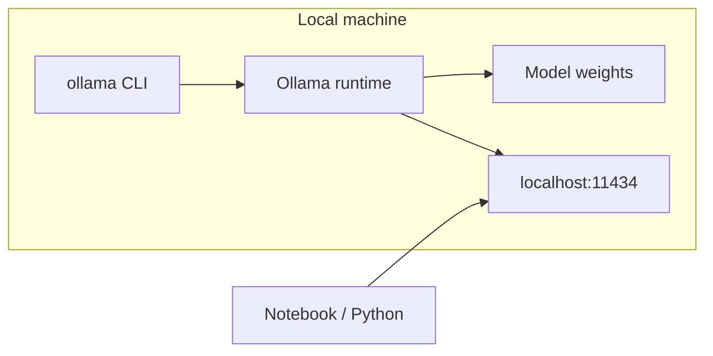
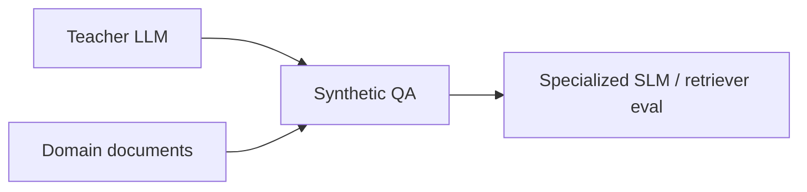
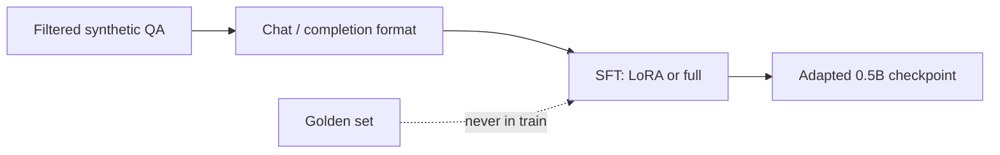

# Learning Objectives

This track is a **data-centric loop**: measure a small model, generate synthetic QA, judge quality, fine-tune, and measure again.


| Day   | Focus                    | Outcome                                           |
| ----- | ------------------------ | ------------------------------------------------- |
| Day 1 | Baseline + generation    | A measured starting point and a synthetic dataset |
| Day 2 | Evaluation + fine-tuning | Evidence that the synthetic data actually helps   |


---

## Learn Day 1 (Baseline, Generation)

- Ollama - Hosting and running models on CPU (Qwen 0.5B)
- Build a golden test set with different failure moeds
- Build a training set
- Synthetic text/QA generation strategies

---


### Ollama: hosting and running models on CPU

**Ollama** is a local runtime for open-weight models. You pull a model once, then serve it over an OpenAI-compatible API on your laptop.




Why start here:

- No GPU required for tiny models such as Qwen 0.5B
- Same API shape as cloud chat completions, so notebook code stays portable
- Weights stay on disk; prompts never leave the machine
- Cheap iteration: swap models with one `ollama pull`

---


### Why a 0.5B model when APIs and larger models exist?

A 0.5B **small language model (SLM)** is the point of the exercise, not a compromise. A large API with your documents in the prompt (or retrieved as RAG) can already answer many questions. This track is about **when you would instead generate synthetic Q&A, fine-tune a small model, and serve that**.


| If you only send documents to a large API…                | Why fine-tune a small model on synthetic data instead                              |
| --------------------------------------------------------- | ---------------------------------------------------------------------------------- |
| Quality looks “good enough” on easy questions             | Failure modes stay hidden until you measure a weak student                         |
| You re-send the corpus (or retrieve chunks) on every call | The student **internalizes** the domain; inference does not need the full handbook |
| Per-token cost and network latency sit in the cloud       | Local SLM is cheap, fast, and runnable on CPU / on-device                          |
| Prompts and documents leave your network                  | Weights stay local; better fit for private policy text                             |
| The skill is prompting a general model                    | The skill is **dataset design** so a small model specializes                       |


Use the large model as a **teacher** (and judge). Use the 0.5B model as the **student** you ship, specialize, or run on-device. Keep the API in the loop when you need an upper bound, not as the production QA system you are trying to learn to replace.

---


### Why fine-tune and not just use RAG?

Having a small fine-tuned model on the top of a RAG system:

- FT is a better choice for fixed data sources (fix document), and RAG is more suitable for constantly changing data. 
- You can fine-tune model to adhere to a style or behaviour, or even teach it to use the provided retrieved text from the RAG pipeline


### Useful Ollama commands

```bash
# install once, then:
ollama serve                          # start the local server (often already running)
ollama pull qwen2.5:0.5b              # download weights
ollama run qwen2.5:0.5b               # interactive chat in the terminal
ollama list                           # models on disk
ollama ps                             # models currently loaded
ollama show qwen2.5:0.5b              # architecture, params, context
ollama rm qwen2.5:0.5b                # free disk if you are done
```

Python talks to `http://localhost:11434` with the OpenAI client (`base_url=.../v1`). Keep `OLLAMA_HOST` and the model name in `.env` so notebooks stay switchable.

---


### Similar models to Qwen 0.5B you can try

Stay in the **sub-2B, CPU-friendly** band so fine-tuning and baseline eval still fit a laptop.


| Model (Ollama tag, check Hub for exact names) | Size  | Notes                                         |
| --------------------------------------------- | ----- | --------------------------------------------- |
| `qwen2.5:0.5b`                                | 0.5B  | Default student; instruction-tuned            |
| `qwen2.5:1.5b`                                | 1.5B  | Same family, stronger baseline, slower on CPU |
| `llama3.2:1b`                                 | 1B    | Good alternate student                        |
| `smollm2:360m`                                | 0.36B | Even tighter; failures are very visible       |
| `gemma2:2b`                                   | 2B    | Upper end for CPU demos                       |
| `phi3:mini`                                   | ~3.8B | Quality jump; often wants more RAM / patience |


Swap the student, **keep the golden set and metrics fixed**, or you cannot compare.

---


### Where synthetic QA shows up

Same loop, different corpora and risk levels.




| Domain            | Typical sources                            | What synthetic QA is for                               |
| ----------------- | ------------------------------------------ | ------------------------------------------------------ |
| **Finance 🏦**    | Filings, product sheets, policy PDFs       | Analyst copilots, internal search eval, compliance Q&A |
| **Healthcare 🏥** | Guidelines, FAQs *(not a clinical system)* | Patient-education bots, protocol lookup                |
| **Sales / CS 🧾** | Catalogs, help center, CRM notes           | Ticket deflection, agent assist, onboarding quizzes    |
| **Software 💻**   | Docs, RFCs, runbooks                       | RAG eval sets, on-call assistants                      |
| **Education 📚**  | Textbooks, lecture notes                   | Practice questions, tutoring SLMs                      |


🔔 Note: Synthetic data is a **multiplier on documents you already trust**. It is not a substitute for labeled production traces when those exist.

---


# Learn Day 2 (Evaluation)

- Supervised-Finetuning of an SLM on synthetic data
- Evaluating usefulness of generated data by evaluating the fine-tuned model

---


### Supervised fine-tuning of an SLM on synthetic data

**SFT** teaches the student to imitate kept pairs: given the prompt (and optional context), emit the answer.




Practical constraints on CPU / small GPU:

- Prefer **LoRA** over full fine-tuning
- Short sequences, small batch, few epochs; stop when golden-set metrics stall
- Match train format to inference format (same system prompt, same context wrapping)

SFT will not add knowledge the teacher never wrote. It **concentrates** style, grounding, and format from the dataset.

---

