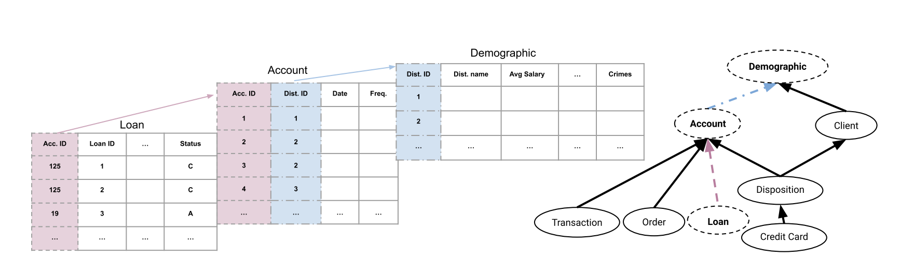

## ClavaDDPM: Cluster Latent Variable guided Denoising Diffusion Probabilistic Models 

While TabDDPM is one of the SOTA models for modeling single-table data, we can have excellent tabular data, but it won't model the relations between parent and child tables. ClavaDDPM is introduced to extend TabDDPM to relational datasets. Thi method leverages clustering labels as intermediaries to model relationships between tables, specifically focusing on foreign key constraints.  ClavaDDPM leverages the robust generation capabilities of diffusion models while incorporating efficient algorithms to propagate the learned latent variables across tables. This enables ClavaDDPM to capture long-range dependencies effectively. 

### Multi-relational databases
Berka is a multi-relational database. This means that its information lives in several tables that are linked by parent–child (foreign-key) relationships, not in one flat table. A **child** table stores a key that points to a row in a **parent** table, so rows only make sense together.

For example, `Loan` is a child of `Account`, and `Account` is a child of `Demographic`. `Acc. ID` connects each loan row to its account, and `Dist. ID` connects each account row to its district (demographic) record. The same idea repeats across the rest of Berka (transactions, orders, clients, and so on): If you generate or model any one table in isolation, you will lose those links.

  

### To Run:

#### Install and activate the virtual env
From the repo root, run `uv sync --dev --group tabular-data` to install tabular data implementation as well as dev dependencies, and start the first Jupyter notebook. Select the kernel and run the cells.

#### Suggested Path

**Multi table:** [`data_preprocessing/README.md`](multi_table/data_preprocessing/README.md) (raw files via `download_and_save_multi_table_data`, then `pre_process_berka_all_tabels.py` or the notebook) → [`training/README.md`](multi_table/training/README.md) / `ClavaDDPM_training.ipynb` → [`synthesizing/README.md`](multi_table/synthesizing/README.md) / `ClavaDDPM_synthesizing.ipynb` → `multi_table/evaluation/multi_table_quality.ipynb` for 1-hop relational metrics. Use [`evaluation/`](evaluation/) for per-table column metrics on a generated table.

