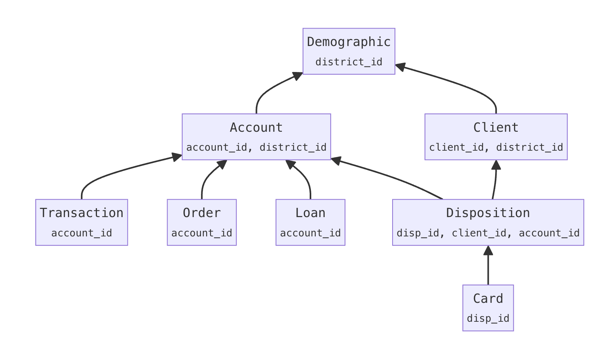
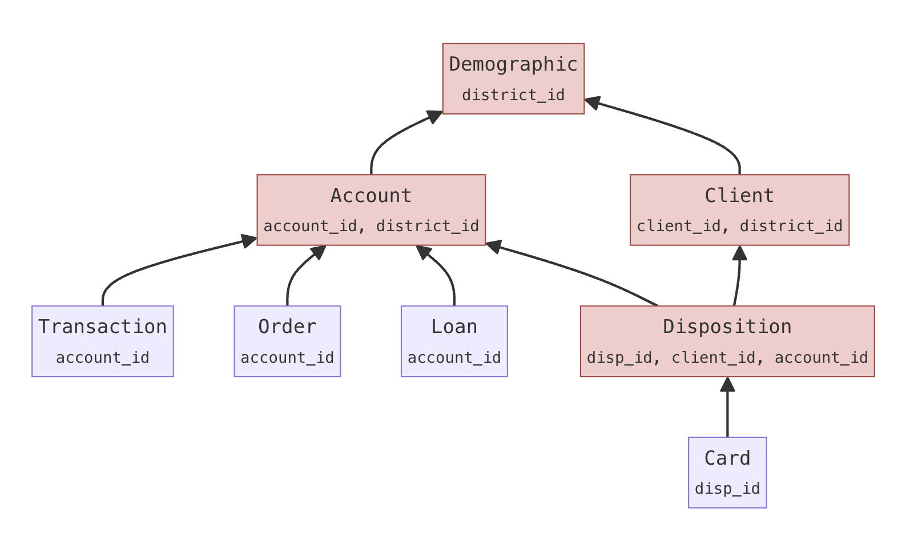
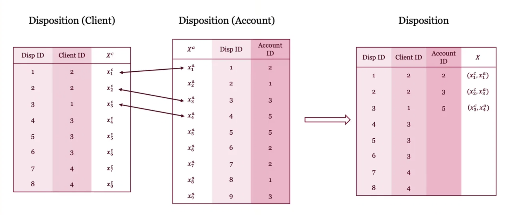

# Data Generation

Synthesis walks `relation_order` **root-first** (for Berka: `district`, then its children, then grandchildren). Each edge uses its own trained checkpoint. Child table size is not chosen independently: it follows from synthetic parents and the learned children-per-parent distribution.

## Artifacts you load

| File | What it contains |
|------|------------------|
| `results/cluster_ckpt.pkl` | Clustered tables plus `all_group_lengths_prob_dicts`: $p(\ell \mid y)$ = how many children $\ell$ a parent of cluster $y$ typically has |
| `results/models/{parent}_{child}_ckpt.pkl` | Denoiser $\epsilon_\theta$, encoders / metadata, and (child edges only) a cluster classifier $p_\phi(y \mid \mathbf{x}_t, t)$ |

The notebook loads these, then calls `clava_synthesizing`.

---

## Generation steps

On Berka the schema looks like this. `district` is the root. `disp` has **two** parents (`client` and `account`); that is why synthesis needs a matching step.

  

### 1. Sample the root table (`None → district`)

**Artifact:** `{None}_{district}_ckpt.pkl` — denoiser only (no classifier).

Draw $n = \lfloor \texttt{sample\_scale} \times n_{\text{real}} \rfloor$ rows with **unconditional** reverse diffusion, in batches of `batch_size`. Start from noise $\mathbf{x}_T \sim \mathcal{N}(0,I)$ and denoise:

$$
\mathbf{x}_{t-1} \;=\; \mu_\theta(\mathbf{x}_t, t) + \sigma_t \mathbf{z},
\qquad \mathbf{z}\sim\mathcal{N}(0,I).
$$

Cluster ids for the next edges (e.g. `district_client_cluster`) are generated as ordinary columns of this table. They are the $y$ values used below.

### 2. Sample each child, given its synthetic parent

Walk every remaining edge `(parent, child)` in `relation_order`. **Artifacts:** that edge’s model pickle (denoiser + classifier) and $p(\ell \mid y)$ from `cluster_ckpt.pkl`.

For each synthetic parent row with cluster $y$:

1. Draw the group size $\ell \sim p(\ell \mid y)$.
2. Sample $\ell$ child rows with **classifier-guided** diffusion toward that $y$.

Guidance adds the classifier gradient to the denoiser (same idea as guided image diffusion). With scale $s =$ `classifier_scale`:

$$
\tilde{\epsilon}(\mathbf{x}_t, t)
\;=\;
\epsilon_\theta(\mathbf{x}_t, t)
\;-\;
s\,\sigma_t\,\nabla_{\mathbf{x}_t}\log p_\phi(y \mid \mathbf{x}_t, t).
$$

$s=0$ ignores the parent cluster; $s=1$ is the usual setting; large $s$ can collapse samples. The root is unaffected.

The actual child count is $\sum \ell$ over synthetic parents, not `sample_scale` applied to the child table. Shrinking the root therefore shrinks descendants while keeping similar cardinalities.

A table that is itself a parent (e.g. `account`) also samples cluster columns for *its* children; those become $y$ on the next edges.

### 3. Match multi-parent children (`disp`)

  

**Artifact:** the two synthetic copies of the same child (not a new trained model). FAISS nearest-neighbor search plus `matching_config`.

`disp` is generated twice: once from `client`, once from `account`. Matching aligns those copies so one row gets both foreign keys. Single-parent tables skip this.

  

If `no_matching` is true, parent ids are shuffled instead (broken relations; baseline only).

---

Outputs go to `workspace_dir / exp_name / {table} / {sample_prefix}_final/` (`GeneralConfig` in the notebook).

---

# ClavaDDPM synthesizer hyperparameters

Set these values in [`config.yaml`](config.yaml). The notebook pases them into `clava_synthesizing`.

ClavaDDPM does **not** take a per-table `n_samples`. The root table is sized from the real data and `sample_scale`. Child tables are then generated from the synthetic parents, using the learned distribution of how many children each parent typically has.

---

## `sampling_config`

Controls how many rows are generated and how the diffusion sampler runs. These settings apply while each parent–child pair is sampled.

### `sample_scale`

Ratio of synthesized rows to original rows for the **root** table (the table with no parent; for Berka this is `district`). Default in the toolkit is `1.0` if you omit it.

- `1.0` — about as many root rows as in the real table.
- `0.25` — about one quarter of the real root table (for example 77 districts → 19).
- `2.0` — about twice as many root rows.

Child tables are **not** sized with a separate knob. For each synthetic parent row, the synthesizer draws a group size from `all_group_lengths_prob_dicts` (saved during clustering: “given this parent cluster, how many children are typical?”). The child count is then roughly:

**number of synthetic parents × typical children-per-parent**

So shrinking the root table (smaller `sample_scale`) shrinks descendants as well, while keeping similar relationship cardinalities. The log line `Sample size: …` is `int(sample_scale * len(real_table))` for every table; for children that is a **target-scale hint**, not a hard cap. The actual child count is the sum of sampled group sizes.

This argument is passed to `clava_synthesizing(..., sample_scale=...)`. It is not a field of `ClavaDDPMSamplingConfig`.

**Trade-off:** lower values are faster and use less memory (important for large children such as `trans`). Higher values cost more compute and may be closer to the original table size for evaluation.

### `batch_size`

How many rows the diffusion model draws **per sampling step**. It does not set the total number of rows.

Larger batches usually run faster on GPU but need more memory. If sampling crashes (out of memory), lower this first. A small value such as `10` is conservative and is fine for a first run.

Used for both the unconditional root-table sampler and the classifier-guided child sampler.

### `classifier_scale`

Guidance strength when generating a **child** table so that rows match the parent’s **cluster label**.

At each denoising step a trained classifier estimates $p(y \mid x_t)$ for the parent cluster $y$. The gradient of that log-probability is multiplied by `classifier_scale` and used to steer the sample (classifier guidance, same idea as guided diffusion).

| Value | Effect |
|-------|--------|
| `0` | No guidance; child rows are not pulled toward the parent cluster. |
| `1.0` | Standard guidance (typical default). |
| `> 1` (for example `2`–`10`) | Stronger parent–cluster consistency; diversity and sample quality can drop. |
| Very large | Over-guidance: rows can collapse or look unnatural. |

The **root** table is sampled unconditionally, so this parameter does not change `district`. It only affects child generation (`conditional_sample_from_diffusion`).

---

## `matching_config`

After each parent–child pair is generated, some children have **more than one parent** (in Berka, `disp` links both `client` and `account`). Matching aligns those separately generated copies of the child so foreign keys are consistent. Tables with a single parent skip this step.

### `num_matching_clusters`

Number of FAISS IVF clusters used when searching nearest-neighbor matches between two synthetic copies of the same child (different parent keys).

- `1` — simplest index; enough for small tables.
- Larger values can speed up search on bigger tables, but the index needs enough rows to train.

This is the `n_clusters` argument to `match_tables`, not the ClavaDDPM training clusters.

### `matching_batch_size`

How many child rows are matched per FAISS search batch.

When `unique_matching` is `true`, the implementation forces this to `1` (each row is matched and then removed from the index). The YAML value then has no effect. When `unique_matching` is `false`, a larger batch is faster.

### `unique_matching`

If `true`, each row in the non-anchor child copy is used at most once (the matched index is removed from FAISS). That avoids assigning the same synthetic row to two different parent ids.

If `false`, nearest-neighbor search can reuse rows; a later pass tries to uniquify indices. Matching is faster but less strict.

### `no_matching`

If `true`, skip nearest-neighbor matching and **randomly shuffle** which parent ids are attached. Use this only as a baseline (broken relational structure). Keep `false` for a normal run.
