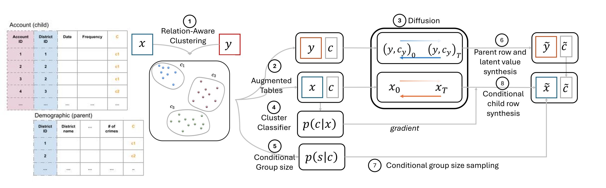
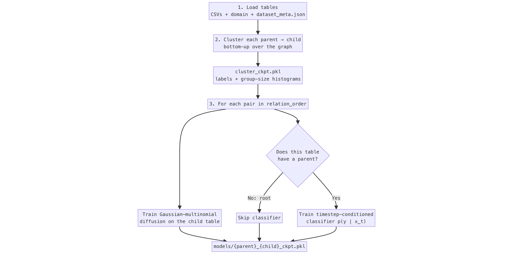
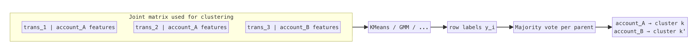
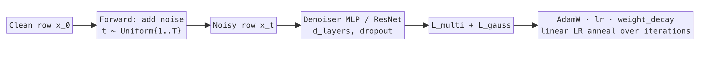
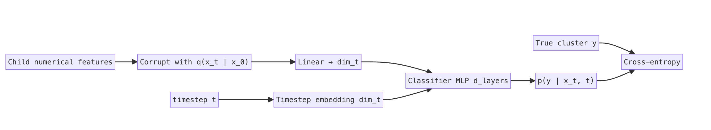

# ClavaDDPM training

Set these values in [`config.yaml`](config.yaml). The notebook [`ClavaDDPM_training.ipynb`](ClavaDDPM_training.ipynb) loads the file with Hydra (`compose(config_name="config")`) and maps each section onto a toolkit dataclass:

| YAML section | Toolkit class | Passed to |
|--------------|---------------|-----------|
| `clustering_config` | `ClavaDDPMClusteringConfig` | `clava_clustering(...)` |
| `diffusion_config` | `ClavaDDPMDiffusionConfig` | `clava_training(...)` |
| `classifier_config` | `ClavaDDPMClassifierConfig` | `clava_training(...)` |

Training is **per parent–child pair** in `relation_order` (from `dataset_meta.json`). The root table has no parent (`None → district` for Berka) and is trained unconditionally. Every other table is trained as a child of its parent, using a cluster label that was added in the clustering step.

The rest of this file first walks through **what training does** (including clustering), then documents each YAML field.

---

# Training pipeline

ClavaDDPM does not train one model on a joined mega-table. It trains a **small family of models**, one for each edge in the relational graph. Clustering is the glue: it compresses “what kind of parent is this?” into a discrete label so child generators can stay consistent with their parents.

## ClavaDDPM Overview

  

This README outlines the training process for the ClavaDDPM model. The diagram above, taken from the original paper, illustrates the main steps:

**(a) Latent learning and table augmentation (steps 1-2)**: This step crossponds to clustering section, where we aim to augmente each table with associated clustering labels that used to capture inter-table relationships.

**(b) Training (steps 3-5)**: This step corresponds to the model training section, where we train separate conditional diffusion models and the cluster classifier models on each augmented table.

**(c) Synthesis (steps 6-8)**: This step corresponds to the model sampling section, where we sample the table size and generate data based on the parent-child constraints (i.e., relation order).

## Why clustering comes first

If you sampled `account` and `trans` independently, synthetic transactions would not line up with synthetic accounts (wrong counts, wrong styles of activity, broken foreign keys).

ClavaDDPM’s answer is:

1. Put every parent–child pair into a shared feature space and find **clusters** of similar groups.
2. Give every parent (and all of its children) one cluster id $y \in \{0,\ldots,K-1\}$.
3. Learn a diffusion model of **child rows**, and a classifier $p(y \mid x_t)$ that recognizes the cluster from a noisy child row.
4. At synthesis time, sample the parent, look up its cluster, then **guide** child sampling toward that cluster (see the [synthesizer README](../synthesizing/README.md)).

Training only does steps 1–3. Guidance itself is a sampling-time operation.

## Training pipeline at a glance

  

On Berka the schema looks like this. `district` is the root. `disp` has **two** parents (`client` and `account`); that is why synthesis later needs a matching step, but training still fits **one model per edge**.

  

---

## Step 1 — Load the tables

`load_tables(data_dir)` expects the **preprocessed** layout (see [`../data_preprocessing`](../data_preprocessing/)):

| File | Role |
|------|------|
| `{table}.csv` | Rows including `*_id` keys |
| `{table}_domain.json` | Feature types: `discrete` or `continuous` |
| `dataset_meta.json` | Parent/child lists and `relation_order` |

IDs are kept for joining during clustering, then dropped from the feature matrix before diffusion. Columns listed as discrete vs continuous in the domain file decide which part of the mixed diffusion they enter.

---

## Step 2 — Cluster parent–child groups

**Function:** `clava_clustering` → `_run_clustering` → `_pair_clustering`.

Clustering walks `relation_order` **in reverse** (leaves first). That way a table that is a child in one pair and a parent in another already has cluster columns from its children before it is clustered with *its* parent.

IMPORTANT: If `results/cluster_ckpt.pkl` already exists, this step is skipped. Delete the file to recompute.

### 2.1 Build one row per child, with the parent attached

For a pair $(\text{parent}, \text{child})$, every child row is concatenated with a copy of its parent’s features (a denormalized join):

$$
\mathbf{z}_i \;=\; \big[\; \mathbf{x}^{\text{child}}_i \;\Vert\; \mathbf{x}^{\text{parent}}_{\pi(i)} \;\big]
$$

where $\pi(i)$ is the parent of child row $i$. All children of the same parent therefore share the parent half of $\mathbf{z}$.

  

### 2.2 Normalize and weight features

Numerical columns of child and parent are stacked, min–max scaled (default), then the **parent block** is multiplied by `parent_scale` $s_p$:

$$
\tilde{x} \;=\; \frac{x - x_{\min}}{x_{\max}-x_{\min}},
\qquad
\tilde{\mathbf{x}}^{\text{parent}} \;\leftarrow\; s_p \,\tilde{\mathbf{x}}^{\text{parent}}.
$$

Categorical columns are one-hot encoded; the parent one-hots are scaled by the same $s_p$. A normalized copy of the foreign key is concatenated as well (key weight is currently fixed at $1$ in the trainer).

Intuition: $s_p > 1$ makes “who the parent is” dominate the clusters; $s_p < 1$ makes “what the children look like” dominate.

### 2.3 Fit clusters

Let $K$ = `num_clusters` (capped at the number of joint rows). With `clustering_method: kmeans` the objective is the usual sum of squared distances to centroids $\boldsymbol{\mu}_k$:

$$
\min_{\{y_i\},\{\boldsymbol{\mu}_k\}}
\sum_{i=1}^{N}
\big\lVert \mathbf{z}_i - \boldsymbol{\mu}_{y_i} \big\rVert^2.
$$

With `gmm` or `kmeans_and_gmm` the model is a mixture of $K$ Gaussians with **diagonal** covariance. `kmeans_and_gmm` only changes initialization (`k-means++`). `variational` uses a Bayesian GMM and keeps **soft** assignments $p(y \mid \mathbf{z}_i)$ instead of a hard label.

### 2.4 One label per parent (majority vote)

Row-level labels are not used as-is. Children of one parent must share a single cluster so the parent can carry a unique $y$.

For parent group $g$ with child labels $\{y_i : i \in g\}$, the group label is the mode:

$$
y_g \;=\; \mathrm{mode}\{ y_i : i \in g \}.
$$

**Agree rate** for that group is the fraction of children that already had $y_g$. The log line `Average agree rate` is the mean of those fractions over groups. Close to $1$ means the row-level clustering was already consistent within parents; lower values mean voting had to override many children.

Variational clustering samples $y_g$ from the group’s averaged soft assignments instead of taking a mode.

Every child of parent $g$ is then overwritten with $y_g$. The same id is written on the parent row as `{parent}_{child}_cluster`. Parents with no children get a leftover extra label.

### 2.5 Group-size distribution (used later for synthesis)

For each cluster $k$, the trainer counts how often a parent in that cluster had exactly $\ell$ children:

$$
p(\ell \mid y = k)
\;=\;
\frac{\#\{\text{parents with cluster }k\text{ and }\ell\text{ children}\}}
{\#\{\text{parents with cluster }k\}}.
$$

These histograms are `all_group_lengths_prob_dicts` in `cluster_ckpt.pkl`. They are **not** used during training of the neural nets; they tell the synthesizer how many child rows to draw for each synthetic parent.

---

## Step 3 — Train a diffusion model per edge

**Function:** `clava_training` → `child_training` → `train_model`.

`relation_order` is walked **forward** (root first). For Berka that starts with `None → district`, then `district → client`, and so on.

IDs are dropped. The remaining columns plus the cluster column (when a parent exists) form a mixed table: some continuous, some discrete.

IMPORTANT: Note that the cluster labels are only added to parent rows to form the data for the diffusion process. Child rows are generated such that their
generation is steered towards a specific cluster. That is the same idea as classifier-guided image diffusion.

### 3.1 Mixed Gaussian–multinomial diffusion (TabDDPM)

A row is split as $\mathbf{x} = (\mathbf{x}^{\text{num}}, \mathbf{x}^{\text{cat}})$.

**Continuous part.** This is a standard Gaussian diffusion. With a cosine or linear schedule one defines $\beta_t \in (0,1)$ and

$$
\alpha_t = 1 - \beta_t,
\qquad
\bar{\alpha}_t = \prod_{s=1}^{t} \alpha_s.
$$

The cosine schedule used by default discretizes

$$
\bar{\alpha}(t) \;=\; \cos^2\!\left(\frac{t + 0.008}{1.008}\,\frac{\pi}{2}\right).
$$

The forward process (training) adds noise in closed form:

$$
q(\mathbf{x}_t^{\text{num}} \mid \mathbf{x}_0^{\text{num}})
\;=\;
\mathcal{N}\!\big(
\sqrt{\bar{\alpha}_t}\,\mathbf{x}_0^{\text{num}},\;
(1-\bar{\alpha}_t)\mathbf{I}
\big).
$$

The network $\boldsymbol{\epsilon}_\theta(\mathbf{x}_t, t)$ is trained to predict that noise. With `gaussian_loss_type: mse`:

$$
\mathcal{L}_{\text{gauss}}
\;=\;
\mathbb{E}_{t,\mathbf{x}_0,\boldsymbol{\epsilon}}
\big\lVert
\boldsymbol{\epsilon} - \boldsymbol{\epsilon}_\theta(\mathbf{x}_t, t)
\big\rVert^2.
$$

(`kl` replaces this with a variational Gaussian term.)

**Categorical part.** Each discrete column is a multinomial diffusion: categories are noised toward a uniform distribution over $T$ steps, and the model predicts clean category logits. That loss is $\mathcal{L}_{\text{multi}}$.

**Total loss** (what `ClavaDDPMTrainer` backprops):

$$
\mathcal{L} \;=\; \mathcal{L}_{\text{multi}} + \mathcal{L}_{\text{gauss}}.
$$

  

Each **iteration** is one mini-batch, not one epoch. Learning rate is annealed linearly to zero over `iterations`. An EMA copy of the denoiser is also tracked.

The **root** table (`None → district`) is trained the same way, but there is no meaningful cluster target: a placeholder column is added and **no classifier** is trained.

### 3.2 What the child model is learning

For a child table the cluster id is present in the dataframe used to build metadata, but the denoiser itself is **not** an ordinary class-conditional DDPM that concatenates $y$ as an extra input (`is_target_conditioned` is `none`). Conditioning on the parent cluster is delegated to the classifier in the next step (classifier guidance at sample time).

---

## Step 4 — Train the cluster classifier (child tables only)

**Function:** `train_classifier`, skipped when `parent is None` or `classifier_config.iterations <= 0`.

Goal: a network $f_\phi$ that, given a **noisy** numerical view of a child row at timestep $t$, predicts the parent–child cluster:

$$
p_\phi(y \mid \mathbf{x}_t^{\text{num}}, t)
\;=\;
\mathrm{softmax}\big( f_\phi(\mathbf{x}_t^{\text{num}}, t) \big).
$$

Training:

1. Sample $t$ uniformly from $\{0,\ldots,T-1\}$ using the **same** $T$ and noise schedule as the diffusion model.
2. Diffuse the numerical features to $\mathbf{x}_t$.
3. Project them to width `dim_t`, add a timestep embedding of the same width, pass through MLP `d_layers`, and output $K$ logits ($K$ is `max(cluster_id)+1`).
4. Minimize cross-entropy against the true cluster $y$.

  

At **synthesis**, this classifier is not used to pick a class after the fact. Its gradient $\nabla_{\mathbf{x}_t} \log p_\phi(y \mid \mathbf{x}_t, t)$ is added into the reverse diffusion step (scaled by `classifier_scale`) so child rows are steered toward the parent’s cluster. That is the same idea as classifier-guided image diffusion.

---

## What training writes to disk

| Path | Produced in | Used for |
|------|-------------|----------|
| `results/cluster_ckpt.pkl` | Step 2 | Cluster columns, $p(\ell \mid y)$, tables |
| `results/models/{parent}_{child}_ckpt.pkl` | Steps 3–4 | Denoiser, optional classifier, encoders, metadata |

Each checkpoint is a `ClavaDDPMModelArtifacts` object. The synthesizer notebook loads the cluster file plus these per-edge pickles; it does not retrain.

---

# Hyperparameter reference

## `clustering_config`

Used in **Step 2** of the notebook (`clava_clustering`). Clustering is skipped if `results/cluster_ckpt.pkl` already exists; delete that file to recompute.

Clustering concatenates each child row with its parent’s features (parent rows are repeated for every child of that parent). Numerical columns are min–max normalized; categoricals are one-hot encoded. Cluster labels are then **voted at the parent-group level**, so every child of the same parent shares one label. That label is stored as `{parent}_{child}_cluster` on both tables. The checkpoint also stores `all_group_lengths_prob_dicts`: for each cluster, the empirical distribution of how many children a parent typically has. Synthesis uses that distribution to size child tables.

### `num_clusters`

Target number of clusters for each parent–child pair.

- A single integer (for example `50`) is used for every pair.
- You may instead pass a mapping of **child table name → count** if some relations need a different granularity (supported by `ClavaDDPMClusteringConfig`, not shown in the example YAML).

The toolkit caps this at the number of rows in the joint clustering matrix. After group-level voting, the **actual** number of unique labels can be smaller or slightly larger than the request (the logs print `Number of cluster centers`). That realized size is written into each table’s domain as the discrete size of the cluster column.

**Trade-off:** more clusters capture finer parent–child structure and give the classifier more classes; too many clusters on a small table produce empty or noisy groups.

### `parent_scale`

Weight of **parent** features relative to **child** features after normalization.

Parent numerical columns and parent one-hot categorical columns are multiplied by this factor. Child features stay at scale `1.0`. Foreign-key values are included separately (the toolkit currently fixes that key weight at `1`).

| Value | Effect |
|-------|--------|
| `1.0` | Parent and child features contribute equally (example default). |
| `> 1` | Clustering is pulled toward parent attributes (groups look more like “types of parent”). |
| `< 1` | Clustering is pulled toward child attributes (groups look more like “types of child”). |

### `clustering_method`

Algorithm that assigns labels on the joint feature matrix. Allowed values (`ClusteringMethod`):

| Value | What runs |
|-------|-----------|
| `kmeans` | scikit-learn `KMeans` (`k-means++`, `n_init="auto"`). Hard labels. |
| `gmm` | `GaussianMixture` with diagonal covariance. Hard labels. |
| `kmeans_and_gmm` | `GaussianMixture` with diagonal covariance **and** `k-means++` initialization (example default). Hard labels. |
| `variational` | `BayesianGaussianMixture`. Soft memberships; group labels are sampled from those probabilities. |

Hard-label methods then pick one cluster per parent group by majority vote among that parent’s children (`Average agree rate` in the logs is how often children of the same parent already shared a label). Variational clustering samples a group label instead of voting.

---

## `diffusion_config`

Used in **Step 3** (`clava_training` → `train_model` for every pair, including the root). This is the **denoiser** that learns mixed continuous (Gaussian) and discrete (multinomial) tabular features.

Unless you add it to YAML, data are split with the toolkit default `data_split_ratios: [0.7, 0.2, 0.1]` (train / validation / test). Only the train split is used for the diffusion optimizer.

### `d_layers`

Hidden widths of the denoising network, in order from the first hidden layer to the last. Example `[512, 512]` is a two-layer MLP with 512 units each.

These become `DiffusionParameters.layers_dimensions`. Wider or deeper nets fit more complex tables and use more memory.

### `dropout`

Dropout probability inside the denoiser MLP/ResNet. `0.0` disables dropout (example default). Non-zero values can reduce overfitting on small tables.

### `num_timesteps`

Length of the diffusion process $T$: how many noise levels the model is trained on.

Also reused when training the **classifier**: noisy examples $x_t$ are drawn with a uniform schedule over these $T$ steps, so the classifier sees the same noise schedule as the denoiser.

Larger $T$ is a more standard diffusion setup and is slower. The example uses `10` for a quick run.

### `model_type`

Architecture of the denoiser (`ModelType`):

- `mlp` — `MLPDiffusion` (example default; typical for tabular ClavaDDPM).
- `resnet` — `ResNetDiffusion`.

`d_layers` and `dropout` apply to whichever architecture you choose.

### `iterations`

Number of **optimizer steps** for the diffusion trainer (`ClavaDDPMTrainer(..., steps=iterations)`), not full epochs over the table.

Each step draws one mini-batch. Example `10` is only enough to check that training runs. Increase this substantially for a real model.

### `batch_size`

Rows per diffusion training batch (`prepare_fast_dataloader`). Larger batches are more stable and usually faster on GPU, but need more memory. `4096` is a common tabular-diffusion size; drop it if you run out of memory (especially on large children such as `trans`).

### `lr`

Learning rate of the diffusion optimizer. Example `0.0006`.

### `gaussian_loss_type`

Loss on the **continuous** (numerical) part of the diffusion (`GaussianLossType`):

- `mse` — train to predict Gaussian noise (example default).
- `kl` — variational KL-style Gaussian loss.

Categorical columns use a separate multinomial diffusion objective regardless of this flag.

### `weight_decay`

L2 regularization coefficient for the diffusion optimizer (example `1e-05`).

### `scheduler`

Noise schedule over `num_timesteps` (`SchedulerType`):

- `cosine` — cosine $\beta$ schedule (example default).
- `linear` — linear $\beta$ schedule.

This schedule is shared with the classifier’s noising process.

---

## `classifier_config`

Used in **Step 3** only for tables that have a parent (`train_classifier`). The root table sets `classifier = None`.

The classifier predicts the parent–child **cluster id** from a noisy numerical view of the row at diffusion timestep $t$. At synthesis time, its gradient steers child samples toward the parent’s cluster (`classifier_scale` in the synthesizer config).

If `iterations` is `0` or negative, classifier training is skipped (a warning is logged).

The split default is again `data_split_ratios: [0.7, 0.2, 0.1]` unless you add that field to YAML. Train batches update weights; validation is evaluated every few steps; a held-out test loop reports `Classifier accuracy`.

### `d_layers`

Hidden widths of the classifier MLP after the timestep embedding (example `[128, 128]`). Passed as `hidden_sizes` to `Classifier`. This network is usually smaller than the denoiser.

### `lr`

Learning rate of the classifier optimizer (`AdamW`). Example `0.0001`. Independent of `diffusion_config.lr`.

### `dim_t`

Width of the **timestep embedding** and of the projection of numerical features into that space (`timestep_dimension` on `Classifier`). Example `128`.

The model embeds $t$, projects the (noisy) numerical features to `dim_t`, combines them, and then predicts a distribution over cluster ids. Larger values give a richer time-conditioned representation at higher compute cost.

### `batch_size`

Rows per classifier training (and eval) batch. Independent of `diffusion_config.batch_size`. Example `4096`.

### `iterations`

Number of classifier optimizer steps. Example `10` is a smoke test. Each step runs one train batch; validation runs periodically. Set this to `0` to skip the classifier entirely (child sampling then has no trained guidance network).

---

## Fields not in the example YAML

These exist on the toolkit configs and take defaults if omitted:

| Field | Default | Role |
|-------|---------|------|
| `diffusion_config.data_split_ratios` | `[0.7, 0.2, 0.1]` | Train / validation / test fractions for the diffusion dataset. |
| `classifier_config.data_split_ratios` | `[0.7, 0.2, 0.1]` | Same split for the classifier dataset. |

Must be three numbers. They do not need to sum to 1 in the validator; the dataset builder uses them as relative percentages.

---

## Outputs

| Path | Contents |
|------|----------|
| `multi_table/results/cluster_ckpt.pkl` | Clustered tables plus group-length distributions. |
| `multi_table/results/models/{parent}_{child}_ckpt.pkl` | `ClavaDDPMModelArtifacts`: diffusion model, optional classifier, encoders, metadata. |

Those artifacts are the inputs to [`../synthesizing`](../synthesizing/). Sampling-time knobs (`sample_scale`, `classifier_scale`, matching) live in the synthesizer config, not here.
