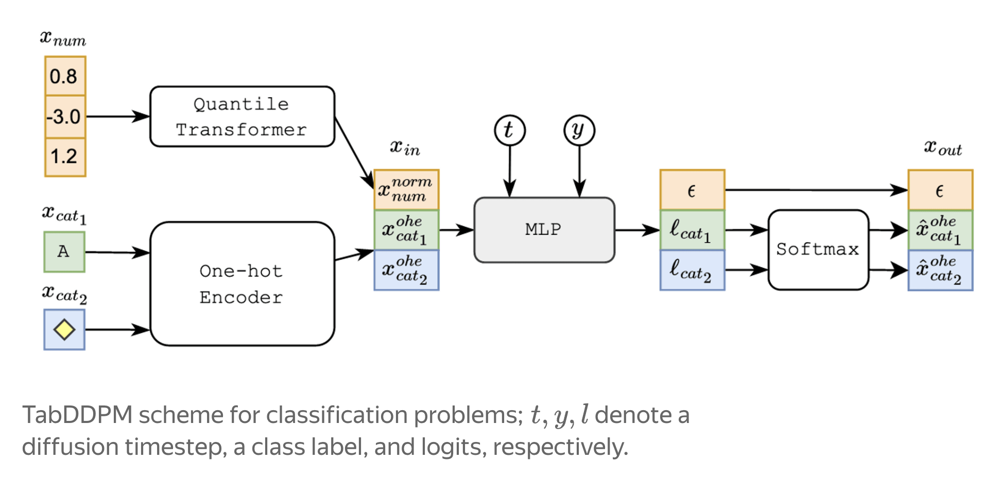

## TabDDPM: modelling tabular data with diffusion models

### Background: Diffusion models
Every diffusion model (image, audio, or tabular) is built on a simple framework: take real data, destroy it with noise in a slow, controlled way, then train a network to undo that destruction one small step at a time.
The same recipe works on a row of a spreadsheet instead of a grid of pixels in an image. We just need to define what "adding noise" and "removing noise" mean for spreadsheet-shaped data.

#### The difference: 
A spreadsheet row is not one homogeneous thing. A pixel is always a continuous brightness value, and neighboring pixels are spatially related. A table row is a grab-bag: `age` is a continuous number, `city` is a category with no natural ordering, `has_subscription` is binary. We can't just "add Gaussian noise" to a category the way you can to a number (pixel in an image)

### TabDDPM

They combine gaussian diffusion and multinomial diffusion to model numerical and categorical features, respectively. Gaussian diffusion models operate in continuous spaces where forward and reverse processes are characterized by Gaussian distributions, while multinomial diffusion are designed to generate categorical data and employs categorical distribution.

  

#### Training 
You never need to actually run the forward process step-by-step during training. Because each forward step just adds a small amount of Gaussian (or multinomial) noise, the closed-form noise level at any timestep `t` can be computed directly in one shot:

Numeric columns:
$$
x_t = \sqrt{\bar{\alpha}_t}\,x_0
+ \sqrt{1 - \bar{\alpha}_t}\,\epsilon,
\qquad
\epsilon \sim \mathcal{N}(0, I)
$$

Categorical columns (one-hot encoded, K possible categories): gets blended into uniform distribution.

$$
x_t = \bar{\alpha}_t x_0 + \frac{1 - \bar{\alpha}_t}{K}\mathbf{1}
$$

Alpha is a precomputed number between 0 and 1 that shrinks as t grows (close to 1 at t=0, close to 0 at t=T). It determines how much noise should be added to get from x_0 to x_t.

**Loss**: They compare the predicted noise to the ground truth added noise: MSE (numeric) + KL (categorical)

Sources:
- https://research.yandex.com/blog/tabddpm-modelling-tabular-data-with-diffusion-models.   
- TabDDPM official repo: https://github.com/yandex-research/tab-ddpm.    
- Tabddpm Paper: https://proceedings.mlr.press/v202/kotelnikov23a/kotelnikov23a.pdf.    

## Example dataset: Berka
The Berka dataset is a collection of financial information from a Czech bank. The dataset deals with over 5,300 bank clients with approximately 1,000,000 transactions. Additionally, the bank represented in the dataset has extended close to 700 loans and issued nearly 900 credit cards, all of which are represented in the data."
Download link: https://www.kaggle.com/datasets/marceloventura/the-berka-dataset

In the single-table reference implementation, we work with the transaction table of this dataset. 
- `trans.csv` table information: https://webpages.charlotte.edu/mirsad/itcs6265/group1/transaction_domain.html

The whole dataset generation is covered in the `multi_table` reference implementation.

### Important Note
Don't forget to activate the tabular_data uv environment before running the notebooks: `uv sync --dev --group tabular-data`
